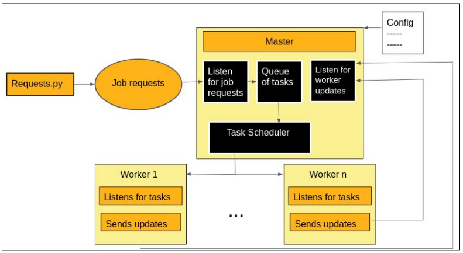

# YACS: Yet Another Centralized Scheduler
‘Yet Another Centralized Scheduler’ (YACS) is a tool for simulating the working
of a distributed processing system on big data. It is responsible for scheduling jobs from
various applications among numerous workers. Practically, the big data workloads run on
many different clusters on multiple machines that are interconnected to each other. This simulated framework consists of one
master and multiple workers. Each of the workers is simulated as though it is on a separate
dedicated machine and each machine is divided into a fixed number of equal-sized slots
which are resource encapsulations. Through our abstraction, we have simulated a
centralized framework with established communication between the master and its
workers, inter-task dependency protection and scheduling along with visualization of the results for performance analysis.

## Workflow

  

### Libraries required
Numpy,
Matplotlib,
json,
socket,
time,
sys,
random,
threading,
os,
datetime,
seaborn,
glob

### Instructions for execution

1) place worker.py, master.py and analysis.py in one directory. 

2) Execute the command 
   python3 master.py <config_file_path> <scheduling_algo_typescheduling_algo_type RR, LL Or RANDOM>

3) make sure requests.py is sending in requests to port 5000

4) Execute the command
   python3 requests.py <no_of_requests>

5) In order to obtain visualizations, after running the master for all algorithms, run the command
   python3 analysis.py
